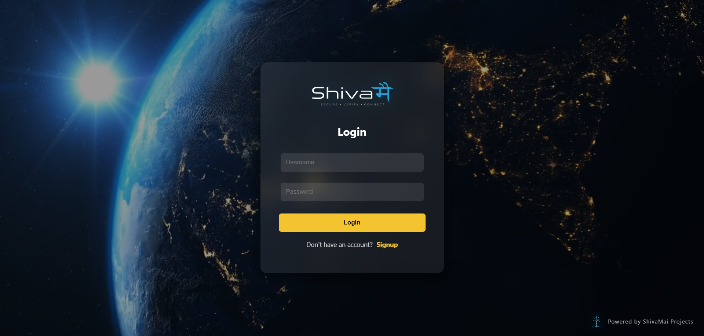
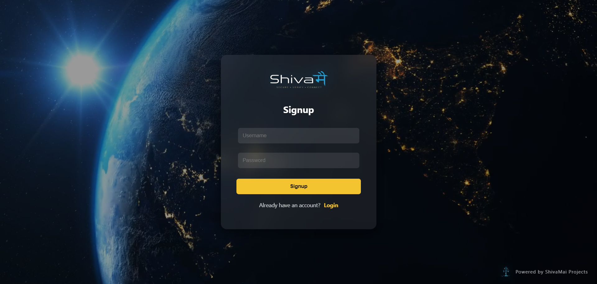
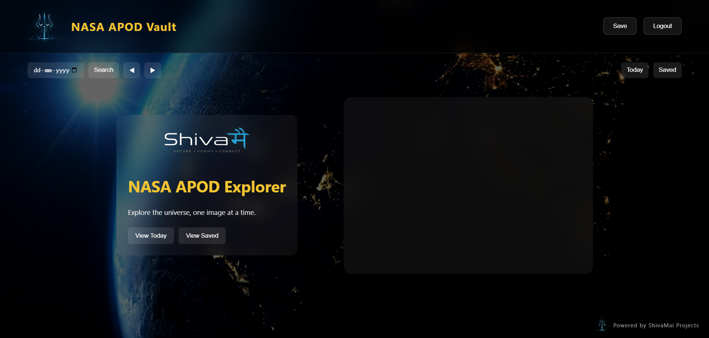
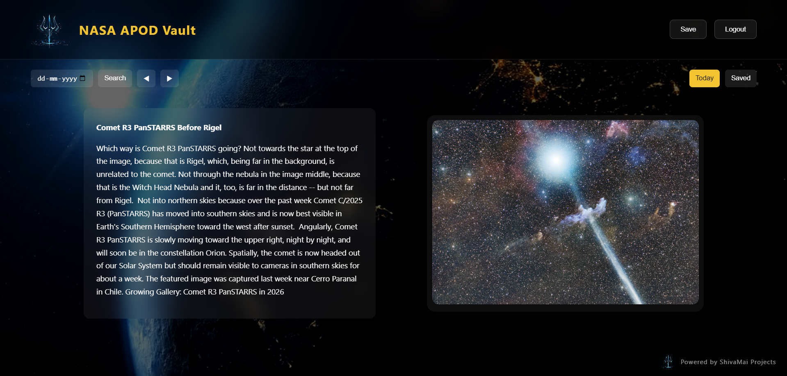
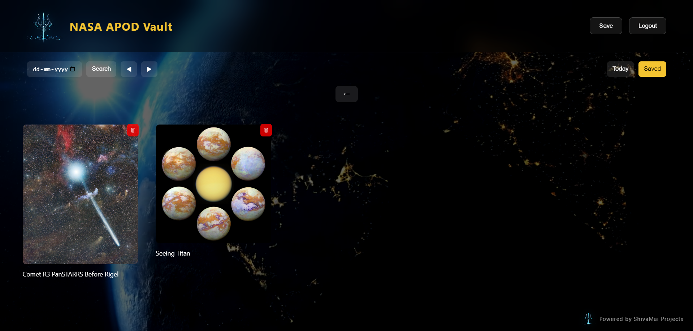

# 🚀 NASA APOD Vault

A full-stack cloud-deployed web application that allows users to explore NASA’s Astronomy Picture of the Day (APOD), securely authenticate using JWT, and save favorite APODs into a personal collection.

---

# 🌌 Overview

NASA APOD Vault is a production-style full-stack application built using Spring Boot, JWT Authentication, PostgreSQL, Docker, and vanilla JavaScript.

The application integrates with NASA’s official APOD API and provides users with a personalized APOD experience.

Users can:

- 🔭 Explore NASA Astronomy Picture of the Day
- 📅 Search APOD by specific date
- 🔐 Register and login securely using JWT authentication
- 💾 Save favorite APODs
- 🗑 Manage saved APOD collection
- ☁️ Access fully deployed cloud-hosted application

---

# 🌐 Live Demo

## Frontend
https://nasa-apod-vault.pages.dev

## Backend Health Endpoint
https://nasa-apod-vault.onrender.com/api/nasa/health

---

# 🔥 Features

- 🌍 Real-time NASA APOD API integration
- 📅 Search APOD by date
- 🔐 JWT-based authentication & authorization
- 💾 Save APOD to personal vault
- 🗑 Delete saved APODs
- ☁️ Cloud deployment with Render & Netlify
- 🐳 Dockerized Spring Boot backend
- 🛡 Secure environment-based configuration
- 🎨 Responsive glassmorphism-inspired UI

---

# 🛠 Tech Stack

## Backend
- Java 21
- Spring Boot
- Spring Security
- JWT Authentication
- Spring Data JPA / Hibernate
- Maven
- Docker

## Frontend
- HTML5
- CSS3
- JavaScript

## Database
- MySQL (Local Development)
- Neon PostgreSQL (Production)

## Deployment
- Netlify (Frontend)
- Render (Backend)
- Neon PostgreSQL (Database Hosting)

## External API
- NASA APOD API

---

# 🏗 System Flow Architecture

```text
                ┌─────────────────────┐
                │     User Browser    │
                └─────────┬───────────┘
                          │
                          ▼
                ┌─────────────────────┐
                │      Frontend       │
                │    (CloudFlare)     │
                │  HTML / CSS / JS UI │
                └─────────┬───────────┘
                          │ REST API Calls
                          ▼
                ┌─────────────────────┐
                │ Spring Boot Backend │
                │      (Render)       │
                └─────────┬───────────┘
                          │
          ┌───────────────┴───────────────┐
          ▼                               ▼
┌──────────────────┐          ┌────────────────────┐
│ NASA APOD API    │          │ Neon PostgreSQL DB │
│ External API     │          │ User & Saved APODs │
└──────────────────┘          └────────────────────┘
```

---

# 📁 Project Structure

```text
nasa-apod-vault/

├── backend/
│   ├── src/main/java/com/openapi/nasa/
│   │   ├── config/
│   │   ├── restcontroller/
│   │   ├── security/
│   │   ├── service/
│   │   ├── entity/
│   │   └── daorepo/
│   │
│   ├── src/main/resources/
│   │   ├── application.properties
│   │   ├── application-local.properties
│   │   ├── application-docker.properties
│   │   └── application-prod.properties
│   │
│   ├── Dockerfile
│   ├── .dockerignore
│   └── pom.xml
│
├── frontend/
│   ├── index.html
│   ├── Homepage.html
│   ├── Signup.html
│   ├── script.js
│   ├── *.css
│   └── assets/
│
└── README.md
```

---

# 🚀 Running Project Locally

# 1️⃣ Backend Setup

## Step 1: Navigate to backend folder

```bash
cd backend
```

## Step 2: Run Spring Boot application

```bash
mvn spring-boot:run
```

## Step 3: Verify backend

Open:

```text
http://localhost:5000/api/nasa/health
```

Expected response:

```json
{
  "database": "CONNECTED",
  "users": 0,
  "status": "UP"
}
```

---

# 2️⃣ Frontend Setup

Open:

```text
frontend/index.html
```

using Live Server or browser.

---

# 🔑 Environment Configuration

You need a NASA API key.

Get API Key:

https://api.nasa.gov/

---

## Local Development Configuration

Add inside:

```text
backend/src/main/resources/application-local.properties
```

Example:
## Local Development Configuration

Create:

```text
backend/src/main/resources/application-local.properties
```

Example configuration:

```properties
# NASA API Configuration
# Generate your API key from:
# https://api.nasa.gov/

nasa.api.key=YOUR_NASA_API_KEY


# JWT Secret Key
# Replace with a strong secret key for token signing

nasa.jwt.secret=YOUR_SECURE_JWT_SECRET


# Database Configuration
# Replace according to your local database setup
# You may use MySQL, PostgreSQL, or any supported relational database

spring.datasource.url=jdbc:mysql://localhost:3306/nasa-directory

spring.datasource.username=YOUR_DATABASE_USERNAME

spring.datasource.password=YOUR_DATABASE_PASSWORD


# JPA Configuration

spring.jpa.hibernate.ddl-auto=update


# Server Port

server.port=5000
```

### Notes

- Replace all placeholder values with your actual local configuration.
- The application is database-vendor flexible and can be configured with:
  - MySQL
  - PostgreSQL
  - MariaDB
  - Other JDBC-compatible relational databases
- Ensure your database server is running before starting the backend.
- Keep local secrets and credentials outside Git tracking.
# 🐳 Docker Support

Backend is fully Dockerized.

## Build Docker Image

```bash
docker build -t nasa-backend .
```

## Run Docker Container

```bash
docker run -p 5000:5000 nasa-backend
```

---

# 🔐 Authentication Flow

1. User registers via Signup page
2. User logs in using credentials
3. Backend validates credentials
4. JWT token is generated
5. Token stored in browser localStorage
6. Frontend sends token in Authorization header
7. Protected APIs validate JWT before access

---

## 📸 Application Screenshots

### 🔐 Login Page



---

### 📝 Signup Page



---

### 🏠 Homepage Dashboard



---

### 🌌 APOD View Experience



---

### 💾 Saved APOD Collection



---

# ☁️ Deployment Architecture

| Layer | Platform |
|---|---|
| Frontend Hosting | CloudFlare |
| Backend Hosting | Render |
| Database Hosting | Neon PostgreSQL |
| Containerization | Docker |

---

# 🛡 Production Features

- Environment-based configuration
- Secure JWT authentication
- Cloud PostgreSQL integration
- Dockerized backend deployment
- CORS configuration for production
- Stateless Spring Security architecture
- Separate local / docker / production profiles

---

# 👨‍💻 Author

Sachin Mogaronkar
